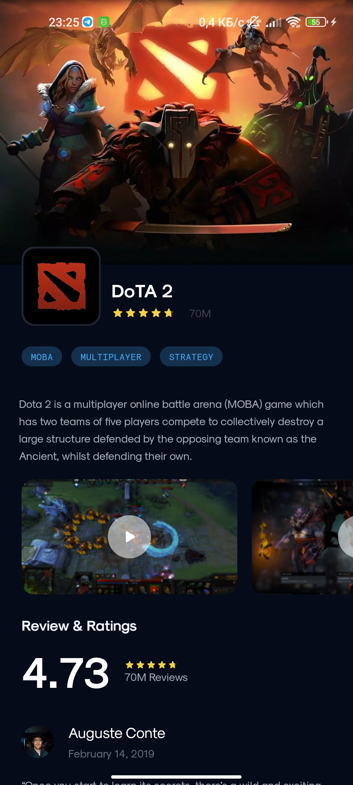
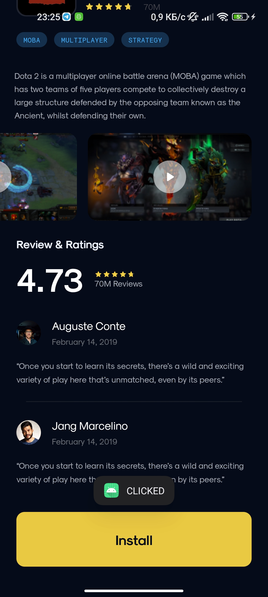

# Android-разработка. Лабораторная работа №1.
### ЦК ОмГТУ 2024

✅ В ходе лабораторной работы был создан экран DoTA 2.

 

⭐ В качестве функциональных особенностей реализована
логика отображения точного рейтинга (от 0 до 5)
в виде пропорционально закрашенных звездочек.
